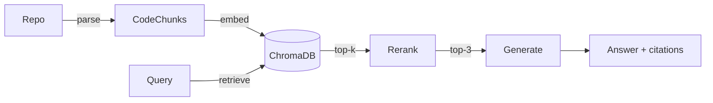

# code-rag

**Ask any Python codebase questions in natural language — get answers with exact `file:line` citations.**

`code-rag` is a retrieval-augmented generation (RAG) system for source code. Point it at a Python repository, ask a question like *"how does the hypothesis stage work?"*, and it returns a grounded answer that cites the specific functions and line numbers it is based on.

The entire pipeline is **hand-written** — no LangChain, no orchestration framework — so every stage is explicit, debuggable, and easy to reason about.

---

## Demo

```
$ python main.py ask "how does the hypothesis stage work" --collection ci-triage-agent

=== Referenced code ===
  src/models.py:152-158        [class]    Hypotheses     score=0.044
  src/hypothesize.py:86-130    [function] hypothesize    score=0.010

╭───────────────────────────────── Answer ─────────────────────────────────╮
│ The hypothesize stage (src/hypothesize.py:86-130) builds a prompt from    │
│ the parsed failure and retrieved context, checks a prompt cache, calls    │
│ the LLM with up to 3 retries, parses the JSON response into Hypothesis    │
│ objects, and returns a Hypotheses object with token counts.               │
╰───────────────────────────────────────────────────────────────────────────╯
```

---

## How it works

A five-stage pipeline, each stage with a single responsibility:



| Stage | What it does | Key tech |
|---|---|---|
| **parse** | Splits source into semantic chunks (functions, classes) via the AST, preserving exact line numbers | Python `ast` |
| **embed** | Encodes each chunk into a 768-d vector and stores it | `bge-base-en-v1.5`, ChromaDB |
| **retrieve** | Embeds the query, finds the top-k nearest chunks by cosine similarity | ChromaDB |
| **rerank** | Re-scores the candidates with a cross-encoder for precision | `bge-reranker-v2-m3` |
| **generate** | Feeds the top chunks to an LLM, which answers with `file:line` citations | DeepSeek V4 |

### Why these choices

- **AST chunking, not fixed-window.** Splitting code every *N* characters cuts functions in half. Chunking on AST boundaries keeps each chunk a complete, semantically coherent unit — and yields exact `file:line` citations for free.
- **Two-stage retrieval.** Vector search (bi-encoder) is fast but approximate; the cross-encoder reranker is accurate but slow. Running the reranker only on the top-k candidates gets the best of both — fast recall, precise ranking.
- **No orchestration framework.** The pipeline is a handful of small, plain-Python modules. Every stage is independently testable and the data flow is fully visible. The goal was to understand RAG, not to wire up a framework.
- **Per-repo isolation.** Each indexed repository lives in its own ChromaDB collection, so answers never leak across codebases.
- **Honest failure.** When the retrieved context doesn't contain the answer, the model says so and points you to where to look — instead of hallucinating.

---

## Tech stack

| Layer | Choice |
|---|---|
| Language | Python 3.11+ |
| Embedding | `BAAI/bge-base-en-v1.5` (768-d) |
| Reranker | `BAAI/bge-reranker-v2-m3` (cross-encoder) |
| Vector store | ChromaDB (persistent, cosine) |
| LLM | DeepSeek V4 (via Anthropic SDK) |
| CLI | `argparse` + `rich` |
| Packaging | `uv` |

---

## Setup

```bash
git clone https://github.com/Meteordashuaibi/code-rag.git
cd code-rag
uv sync
```

Create a `.env` file with your LLM API key:

```
DEEPSEEK_API_KEY=your-key-here
```

> On first run, the embedding (~440 MB) and reranker (~2.3 GB) models are downloaded from HuggingFace and cached locally.

---

## Usage

```bash
# Index a repository (collection is named after the folder by default)
python main.py index /path/to/some/repo

# Ask a question about it
python main.py ask "how does authentication work" --collection repo-name

# List all indexed repositories
python main.py list
```

---

## Limitations & roadmap

Current scope is intentionally narrow:

- **Python only** — chunking relies on the Python AST.
- **Function / class granularity** — module-level code and very long functions are not split further yet.
- **Dense retrieval only** — keyword (BM25) hybrid search is the next planned improvement.

Roadmap:

- [ ] Hybrid retrieval (dense + BM25)
- [ ] Code-specific embedding model
- [ ] Qualified names for methods (`Class.method`)
- [ ] Split long functions with overlap
- [ ] Web UI

---

## License

MIT
